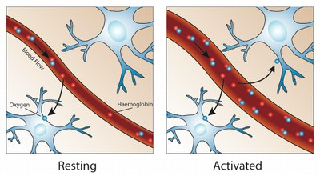

# Neuroimaging

This repository is about machine learning techniques on decoding brain activity. We are using functional magnetic resonance imaging (FMRI) data to represent human brain by a functional connectivity graph. These graphs are mostly being used for practically and objectively manipulating brain state and it's effect on functional connectivity patterns, individual differences, and predicting cognition and behavior. Currently we are working on non-parametric techniques on semi-supervised models for augmenting available labeled data by a large number of unlabeled examples.

  

